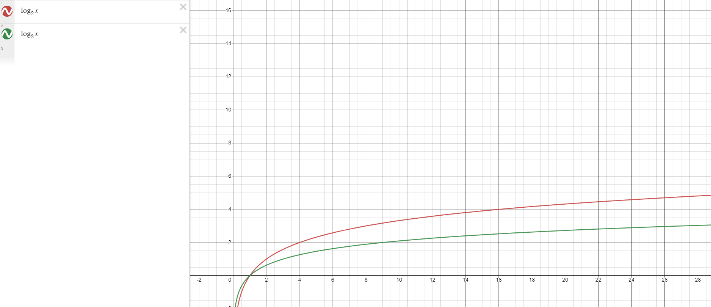

# push_swap
> push_swap은 두 개의 스택을 사용해서 일반적인 `퀵 정렬` 또는 `병합 정렬` 보다 더 적은 연산으로 정렬하는 프로그램입니다.

- 스택은 double_linked_list로 구현되어 있습니다.
- 일반적인 퀵 정렬이 피봇을 하나 가지는 반면, 이 프로그램에서는 피봇을 두 개 가집니다.

## 퀵 정렬에서 피봇의 갯수에 따른 평균 성능 비교

- pivot = 1 인 경우

    모든 항목을 피봇(pivot)이랑 비교하니까 정확히는 n-1번인데, 편의상 n번이라고 하자.  
    그리고 반을 갈라서, 각각 반을 동일한 연산을 수행하므로 전체 수행 시간은.  
    n번 더하기 반에대한 동일연산을 두번 수행한 것이므로 아래와 같다.  
```math
    \begin{align}
    T(n) \ &= \ 2T(\frac{n}{2}) \ + \ n\\
    &= \ 2(2T(\frac{n}{4}) \ + \ \frac{n}{2} \ ) \ + \ n \ = \ 4T(\frac{n}{4}) \ +2n\\
    &= \ 4(2T(\frac{n}{8}) \ + \ \frac{n}{4} \ ) \ + \ n \ = \ 8T(\frac{n}{8}) \ +3n\\
    & \ \  \  \  \  ...\\
    &= \ 2^{x}T(\frac{n}{2^{x}}) \ + \ xn
    \end{align}
```
```math
    if \ n = 2^{x}, x = \log_2 n \ \rightarrow \ 2^{\log_2 n}T(1) + n\log_2 n
```
```math
    \because \ T(1)=1, \  T(n) \ = \ n+n\log_2 n
```
```math
    \therefore \ O(n\log n)
```
- pivot = 2 인 경우
```math
    \begin{align}
    T(n) \ &= \ 3T(\frac{n}{3}) \ + \ 2n\\
    &= \ 3(3T(\frac{n}{9}) \ + \ 2*\frac{n}{3} \ ) \ + \ 2n \ = \ 9T(\frac{n}{9}) \ +4n\\
    &= \ 9(3T(\frac{n}{27}) \ + \ 2*\frac{n}{9} \ ) \ + \ 4n \ = \ 27T(\frac{n}{27}) \ +6n\\
    & \ \  \  \  \  ...\\
    &= \ 3^{x}T(\frac{n}{3^{x}}) \ + \ 2xn
    \end{align}
```
```math
    if \ n = 3^{x}, x = \log_3 n \ \rightarrow \ 3^{\log_3 n}T(1) + 2n\log_3 n
```
```math
    \because \ T(1)=1, \  T(n) \ = \ n+2n\log_3 n
```
```math
    \therefore \ O(n\log n)
    $$
```
이와 같이 pivot이 1인 경우와 2인경우의 Big-O 표기법은 같지만 실제로 pivot이 2인 경우는 log의 밑이 3으로 아래의 그래프를 보더라도 데이터의 수(x)가 많아질수록 시간(y)이 적게 걸린다는 것을 알 수 있다.



## 스택 2개에 피봇 2개로 정렬하는 방법을 그림으로 확인.


## 연산들 목록

`sa` : `swap a` - 스택 `a`의 가장 위에 있는 두 원소(혹은 첫 번쨰 원소와 두 번째 원소)의 위치를 서로 바꾼다.

`sb` : `swap b` - 스택 `b`의 가장 위에 있는 두 원소(혹은 첫 번쨰 원소와 두 번째 원소)의 위치를 서로 바꾼다.

`ss` : `sa`와 `sb`를 동시에 실행한다.

`pa` : `push a` - 스택 `b`에서 가장 위(탑)에 있는 원소를 가져와서, 스택 `a`의 맨 위(탑)에 넣는다. 스택 `b`가 비어 있으면 아무 것도 하지 않는다.

`pb` : `push b` - 스택 `a`에서 가장 위(탑)에 있는 원소를 가져와서, 스택 `b`의 맨 위(탑)에 넣는다. 스택 `a`가 비어있으면 아무 것도 하지 않는다.

`ra` : `rotate a` - 스택 `a`의 모든 원소들을 위로 1 인덱스 만큼 올린다. 첫 번째 원소(탑)는 마지막 원소(바텀)가 된다.

`rb` : `rotate b` - 스택 `b`의 모든 원소들을 위로 1 인덱스 만큼 올린다. 첫 번째 원소(탑)는 마지막 원소(바텀)가 된다.

`rr` : `ra`와 `rb`를 동시에 실행한다.

`rra` : `reverse rotate a` - 스택 `a`의 모든 원소들을 아래로 1 인덱스 만큼 내린다. 마지막 원소(바텀)는 첫 번째 원소(탑)가 된다.

`rrb` : `reverse rotate b` - 스택 `b`의 모든 원소들을 아래로 1 인덱스 만큼 내린다. 마지막 원소(바텀)는 첫 번째 원소(탑)가 된다.

`rrr` : `rra`와 `rrb`를 동시에 실행한다.

## 실행 방법
1. 실행파일 생성 명령어 : `make`
2. 프로그램 실행 명령어 : `./push_swap [정렬할 숫자들을 인자로]`
    - 어떤 연산이 실행되었는지 직접 확인 : `./push_swap 2 1 3 6 5 8`　또는　`ARG="4 67 3 87 23"; ./push_swap $ARG`
    - 연산들의 횟수를 확인 : `./push_swap 2 1 3 6 5 8 | wc -l`
    - 제공되는 checker 프로그램으로 확인 : `ARG="4 67 3 87 23"; ./push_swap $ARG | ./checker_OS $ARG`  
         checker 프로그램은 push_swap 프로그램으로 생성할 명령어 목록이 실제로 스택을 올바르게 정렬하고 있는지 확인할 수 있습니다. 

---
## 배운내용 Notion에서 확인
https://donpark.notion.site/push_swap-95-66-29day-1723d9eee2af48d9a6545b42e2ffa613
