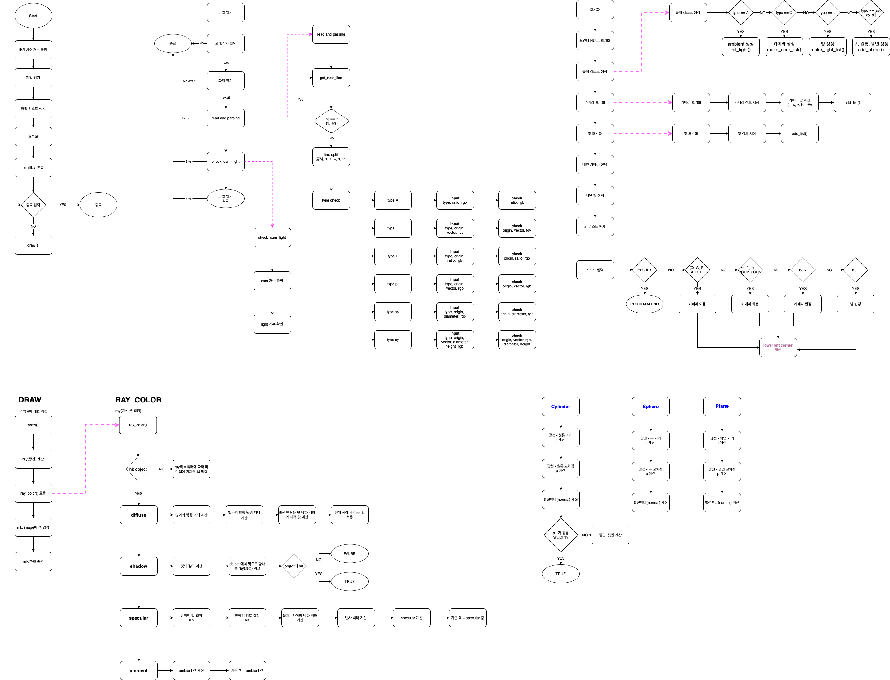
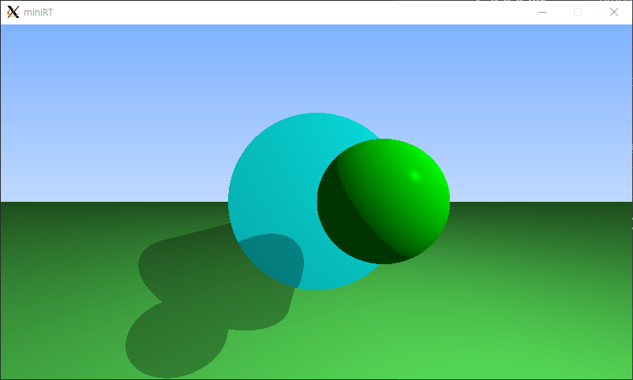
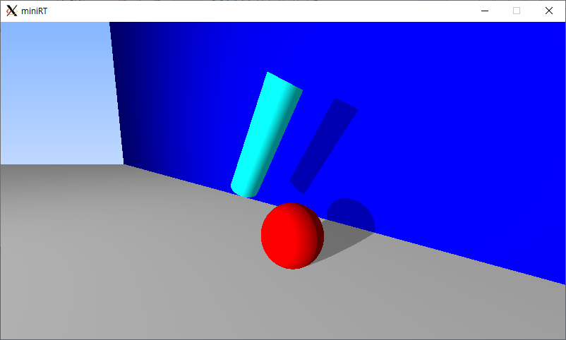
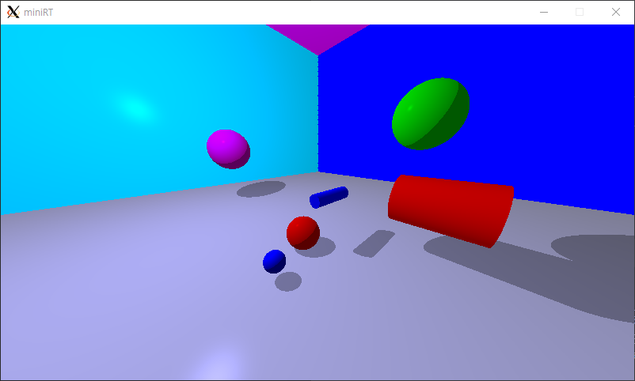
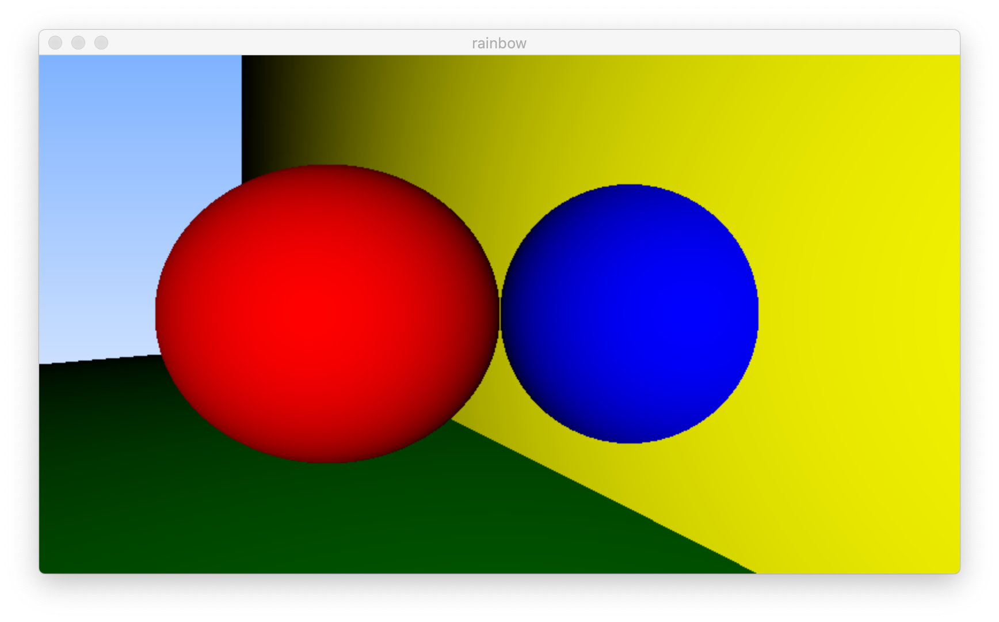
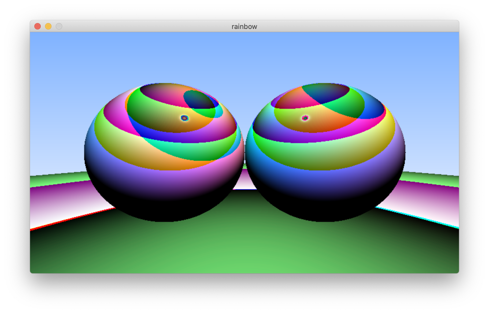
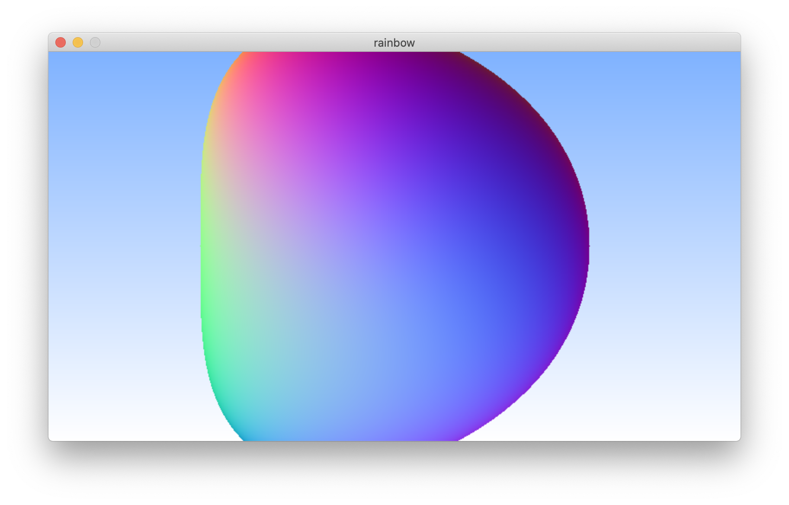

# miniRT
miniRT는 `*.rt` 파일을 읽어서 `minilix 라이브러리`를 사용해 물체(구, 원기둥, 평면, ...)를 `레이트레이싱(Ray Tracing)` 방식을 사용해 그래픽으로 변환하는 프로그램 입니다.

## 실행방법
1. 실행 파일 생성 명령어 : `make`
2. 실행 명령어 : `./miniRT rt_files/basic_shapes/ambient.rt`
    - rt_files에 물체에 대한 여러 예시 파일이 있습니다.
3. 카메라 조정 키
    - `↑` : 위로 회전
    - `↓` : 아애로 회전
    - `←` : 왼쪽으로 회전
    - `→` : 오른쪽으로 회전
    - `Q` : 앞으로 이동
    - `E` : 뒤로 이동
    - `W` : 위로 이동
    - `S` : 아래로 이동
    - `A` : 왼쪽으로 이동
    - `D` : 오른쪽으로 이동
    - `B` : 다음 카메라로 이동
    - `N` : 이전 카메라로 이동
    - `L` : 다음 빛으로 변경
    - `K` : 이전 빛으로 변경

## *.rt file 설명
| TYPE | DESCRIPTION |
| --- | --- |
| A(주변광) | 밝기 [0.0, 1.0] 사이 값 / RGB 값[0, 255] ex)13, 254, 213 |
| C(카메라) | x, y, z 좌표 / 3d vector 값[-1, 1] x, y, z 좌표 당 하나 씩 총 3개 / 화각[0, 180] |
| L(빛) | x, y, z 좌표 / 밝기[0, 1] / RGB 값[0, 255] |
| sp(구) |  구 중심 좌표(x, y, z) / 지름 / RGB 값[0, 255] |
| pl(평면) | x, y, z 좌표 / 3d vector 값[-1, 1] / RGB 값[0, 255] |
| cy(원통) | x, y, z 좌표 / 3d vector 값[-1, 1] / 지름 / 높이 / RGB 값[0, 255] |

## FLowchar

## 실행 이미지

---
## 배운내용 Notion에서 확인
https://donpark.notion.site/miniRT-137-93-45day-65c3e36aaf1d4efe94ff9cfed0ef2205

---
## 하면서 잘못된 코드로 인해 신기하게 나왔던 모양

