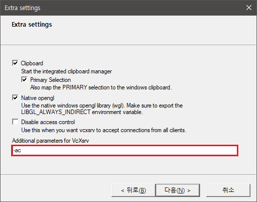
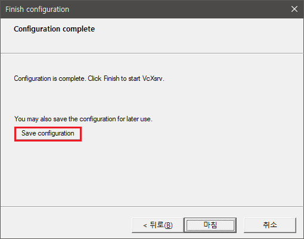
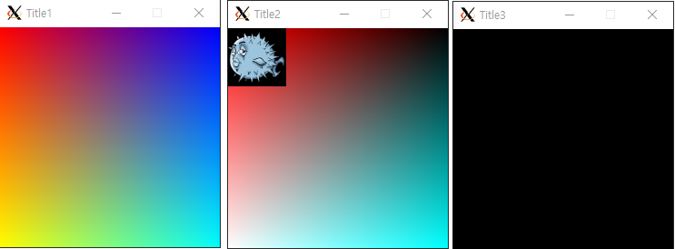

# FDF
FDF는 minilibx 라이브러리를 사용하여 지도에 대한 정보를 파일로 부터 읽어서 그래픽으로 변환하는 프로그램입니다.
    


1. 실행파일 생성 명령어 : `make`
2. 실행 명령어 : ./fdf test_maps/42.fdf  
    42.fdf 이외에도 어려 map 이 있습니다.

---

##  Windows WSL2 환경에서 MiniLibX 세팅하기

<h3 style="color:#1ABC9C">X windows server 설치</h3>

1. [vcxsrv](https://sourceforge.net/projects/vcxsrv/)에 들어가 설치를 한다.
2. 설치 후 바탕화면에 생긴 X launch를 실행
3. 계속 다음하다가 이부분 `-ac`만 주의해서 설정한다.
    
    
    
4. 마지막에 이 창에서 `Save configuration` 버튼을 눌러 따로 저장한다. 
다음부터 저장한파일을 실행시키면 된다.
    
    

<h3 style="color:#1ABC9C">X server 환경 설정 및 확인</h3>


```bash
# 환경변수 DISPLAY 설정
echo 'export DISPLAY=$(grep -oP "(?<=nameserver ).+" /etc/resolv.conf):0' >> ~/.zshrc
source ~/.zshrc

# 환경변수 DISPLAY 확인
echo $DISPLAY

# GUI 연동 확인을 위한 테스트
sudo apt-get -y update && sudo apt-get -y upgrade       ## 패키지 업데이트 및 업그레이드
sudo apt-get install -y x11-apps                        ## x11 어플리케이션 설치
xclock                                                  ## xclock 실행
```

<h3 style="color:#1ABC9C ">minilibx-linux 설치</h3>

1. minilibx-linux 사용하기위해 필요한 패키지 설치 (gcc, make, xorg, libxext-dev, libbsd-dev)
    ```bash
    sudo apt-get -y update && sudo apt-get install -y gcc make xorg libxext-dev libbsd-dev
    ```

2. [https://github.com/42Paris/minilibx-linux](https://github.com/42Paris/minilibx-linux) 여기서 깃클론해서 받고, `make`명령 실행

3. `minilibx-linux/test/` 폴더에 `./mlx-test` 실행시 아래와 같이 3개의 창이 생성되면 시작 단계 완료!!
    

---
## 배운내용 Notion에서 확인
https://donpark.notion.site/fdf-116-102-14day-1d063797e9e54fb99449803d95978cb8