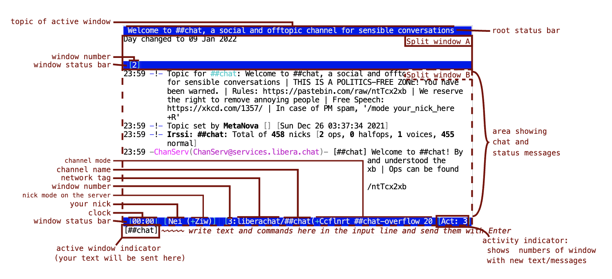
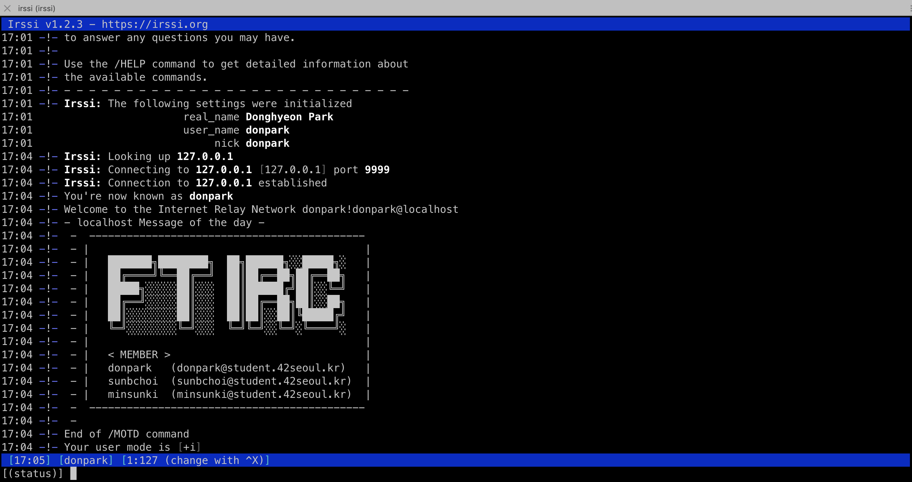

# ft_irc

> ft_irc 는 C++ 로 IRC Server를 만드는 프로젝트입니다.

## 간단 설명
IRC(Internet Relay Chat)는 인터넷의 텍스트 기반 통신 프로토콜입니다.
이 프로젝트는 RFC1459, RFC2812 이외에도 IRC 프로토콜에 대한 RFC 문서를 참고 해서 TCP 통신할때, 특정 규칙에 맞는 문자를 만들어서 클라이언트와 서버 간에 통신하게 됩니다.  
단, 스레드를 사용하지 않고, 하나의 프로세스에 하나의 스레드를 이용한 다중 입출력 방식을 사용합니다.  

다중 입출력 방식은 폴링(polling) 한다고 할 수 있는데,  
폴링이란 하나의 장치(또는 프로그램)가 충돌 회피 또는 동기화 처리 등을 목적으로 다른 장치(또는 프로그램)의 상태를 주기적으로 검사하여 일정한 조건을 만족할 때 송수신 등의 자료처리를 하는 방식을 말합니다.  
즉, non-blocking 방식으로 동작한다고 볼 수 있습니다.

다중 입출력 방식에 사용한 함수 : `poll`  


클라이언트는 `irssi` 를 설치해서 사용하거나 `nc` 명령어를 사용해서 테스트 하면 됩니다.

## irssi 설치
```bash
brew install irssi
```
```bash
apt-get install -y irssi
```

## 실행 방법
1. 실행 파일 생성 명령어 : `make`
2. 실행 파일 실행 명령어 : `./ircserv <port> <password>`
3. irssi 실행 명령어 : `irssi`
    - irssi 설정 정보 확인 : `/set`
    - irssi 종료 : `/quit`
    - irssi 도움말 : `/help`
    - irssi 탭간 이동 : `/<window number>`
        
    - 서버 접속 : `/connect 127.0.0.1 <port> <password>`
        
    - 시간 : `/time`
    - 닉네임 변경 : `/nick <새로운 닉네임>`
    - motd(Message of the day) : `/motd`
    - 채널 생성 또는 가입 : `/join <채널명>`
    - 채널 떠나기 : `/leave`
    - 채널 초대 : `/invite <닉네임> [채널]`
    - 채널에서 내보내기 : `/kick [채널] <닉네임>` 
    - 메시지 보내기 : `/msg <수신자> <메시지 내용>`
    - 공지 보내기 : `/notice <수신자> <메시지 내용>`

---
## 배운내용 Notion에서 확인
- https://donpark.notion.site/ft_irc-94f25dd6023a444491a6b70280f8ef75
- [block I/O & non-block I/O](https://donpark.notion.site/I-O-48279f3a0234458ba57dd013cee0a954)
