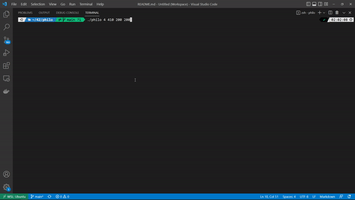
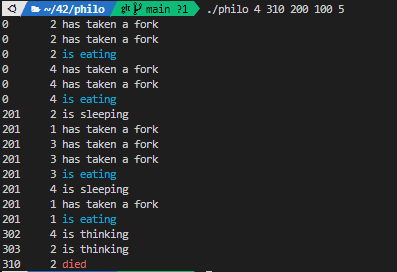

# Philosopher

> philo는 철학자가 n명, 포크가 n개 있을때 철학자는 양손에 포크를 들어야 식사를 할 수 있다.
철학자는 특정시간동안 식사를 할 수 있고, 일정시간동안 식사를하지 못하면 철학자는 죽게됩니다.
철학자가 최대한 죽지 않으면서 교착상태(데드락) 와 기아 상태가 발생하지 않도록 실행되는 프로그램입니다.  
`스레드와 뮤텍스`, `프로세스와 세마포어`를 이해하고 학습한 프로젝트입니다.

## 실행방법
1. 실행파일을 생성하는 명령어 : `make`
2. 실행 명령어 : `./philo [철학자의 수 = 포크 수] [먹지못하면 죽는 시간] [먹는 시간] [자는 시간]`
- 안 죽는 경우: `./philo 4 410 200 200`
    
- 죽는 경우 : `./philo 4 310 200 100`  
    
    
---
## 배운내용 Notion에서 확인
https://donpark.notion.site/Philosophers-120-79-41day-353f556df01c4e8abe745aff0f70af0a